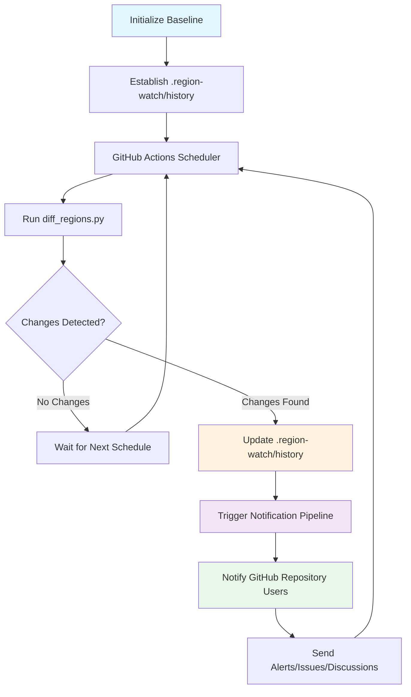

# Foundry Model Availability Notifications

## System Flow

## How It Works

1. **Establish Baseline**: Initialize the monitoring system with current model availability across regions
2. **Scheduled Monitoring**: GitHub Actions runs `diff_regions.py` on a regular schedule
3. **Change Detection**: Compare current state against historical data in `.region-watch/history`
4. **Notification Trigger**: When differences are detected, automatically notify repository users about model availability changes

This tool helps teams stay informed about Azure OpenAI model availability across different regions without manual monitoring.