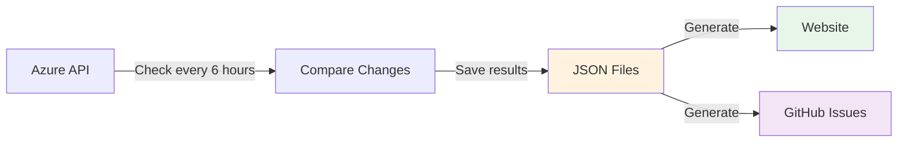

# Azure AI Foundry Model Availability Tracker

Automatically track which Azure AI models are available in which regions. Get notified when new models or regions become available.

**View Live Dashboard**: [https://JinLee794.github.io/foundry-model-availability-notifications](https://JinLee794.github.io/foundry-model-availability-notifications)

## What Does This Do?

This project monitors Azure AI Foundry and:

- Checks model availability every 6 hours
- Detects when new models or regions are added/removed
- Creates GitHub issues to notify you of changes
- Publishes an interactive website showing all available models

## How It Works



### Simple Explanation

1. **GitHub Actions runs every 6 hours**
   - Fetches current model data from Azure
   - Compares it to the previous snapshot

2. **If changes are detected:**
   - Saves the new data to `.region-watch/regions_snapshot.json`
   - Records the change in `.region-watch/history/`
   - Creates a GitHub issue describing what changed

3. **Website is automatically updated:**
   - Reads the JSON data files
   - Generates markdown pages with tables and filters
   - Builds a static site with MkDocs
   - Deploys to GitHub Pages

### The Data is the Source of Truth

Everything comes from the JSON files in `.region-watch/`:

- `regions_snapshot.json` - Current state of all models
- `history/diff-*.json` - Record of all changes over time

The website and notifications are just different ways to view this same data.

## Project Structure

```
├── .github/workflows/
│   ├── region-watch.yml       # Monitors Azure API every 6 hours
│   └── deploy-docs.yml        # Builds and deploys website
│
├── .region-watch/
│   ├── regions_snapshot.json  # Current model availability (source of truth)
│   ├── history/               # Historical changes
│   ├── diff_regions.py        # Detects changes
│   └── render_markdown.py     # Creates summary table
│
├── docs/                      # Generated website content
├── generate_docs.py           # Converts JSON to website pages
└── mkdocs.yml                 # Website configuration
```

## Quick Start

### View the Website

Visit [https://JinLee794.github.io/foundry-model-availability-notifications](https://JinLee794.github.io/foundry-model-availability-notifications)

### Run Locally

```bash
# Install dependencies
pip install mkdocs mkdocs-material

# Generate website pages from latest data
python generate_docs.py

# Preview the site at http://localhost:8000
mkdocs serve
```

### Manually Check for Changes

```bash
# Install dependencies
pip install requests

# Check current availability and detect changes
python .region-watch/diff_regions.py > region_diff.json

# View the changes
cat region_diff.json
```

## What Gets Generated

### Website Pages

- **Home** - Overview and quick stats
- **All Models** - Searchable table of all models
- **By Region** - Filter by Azure region
- **By SKU Type** - Filter by deployment type (Standard, Provisioned, etc.)
- **Change History** - Timeline of all availability changes
- **Individual Model Pages** - Detailed view for each model

### Notifications

When changes are detected, a GitHub issue is automatically created with:

- Summary of what changed
- List of added/removed regions per model
- Link to the website for full details

**Get Notified Automatically:**

To receive notifications when model availability changes:

1. Watch this repository (click "Watch" at the top)
2. Configure your notification settings to include "Issues"
3. You'll get notified whenever a new issue is created with the `region-watch` label

**Tag Specific Users:**

You can configure automatic mentions by setting the `ISSUE_ASSIGNEES` environment variable in the workflow:

```yaml
# In .github/workflows/region-watch.yml
- name: Notify via GitHub issue
  env:
    ISSUE_ASSIGNEES: "user1,user2,user3"  # Add this line
```

This will automatically assign and notify specific team members when changes are detected

## Key Files Explained

| File | Purpose |
|------|---------|
| `.region-watch/regions_snapshot.json` | **The source of truth** - Current state of all models |
| `.region-watch/diff_regions.py` | Fetches data from Azure and compares to snapshot |
| `generate_docs.py` | Reads JSON and creates markdown pages |
| `mkdocs.yml` | Configures the website theme and navigation |
| `.github/workflows/region-watch.yml` | Runs the monitoring every 6 hours |
| `.github/workflows/deploy-docs.yml` | Builds and publishes the website |

## Workflows

### Monitoring Workflow

**File**: `.github/workflows/region-watch.yml`

**When it runs:**

- Every 6 hours automatically
- Manually via GitHub Actions UI

**What it does:**

1. Fetch current model data from Azure
2. Compare to previous snapshot
3. Save new snapshot
4. Create GitHub issue if changes found
5. Trigger website rebuild

### Documentation Workflow

**File**: `.github/workflows/deploy-docs.yml`

**When it runs:**

- After monitoring workflow completes
- When you edit docs files
- Manually via GitHub Actions UI

**What it does:**

1. Run `generate_docs.py` to create pages
2. Build static site with MkDocs
3. Deploy to GitHub Pages

## Customization

### Change Monitoring Frequency

Edit `.github/workflows/region-watch.yml`:

```yaml
on:
  schedule:
    - cron: "23 */6 * * *"  # Change to your preferred schedule
```

### Modify Website Theme

Edit `mkdocs.yml` to change colors, features, or navigation.

### Add Custom Pages

Add your own markdown files to `docs/` and reference them in `mkdocs.yml` navigation.

## Why This Architecture?

**Separate data from presentation:**

- JSON files = reliable data storage
- Website = one way to view the data
- Could add other UIs (CLI tool, Slack bot, etc.) using the same data

**Automatic and hands-off:**

- GitHub Actions handles everything
- No servers to maintain
- Free hosting on GitHub Pages

**Transparent history:**

- All changes are committed to git
- Full audit trail of what changed when
- Can recreate website from any point in history
